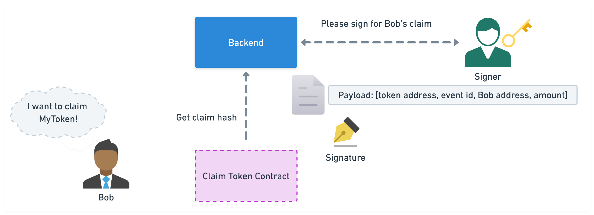
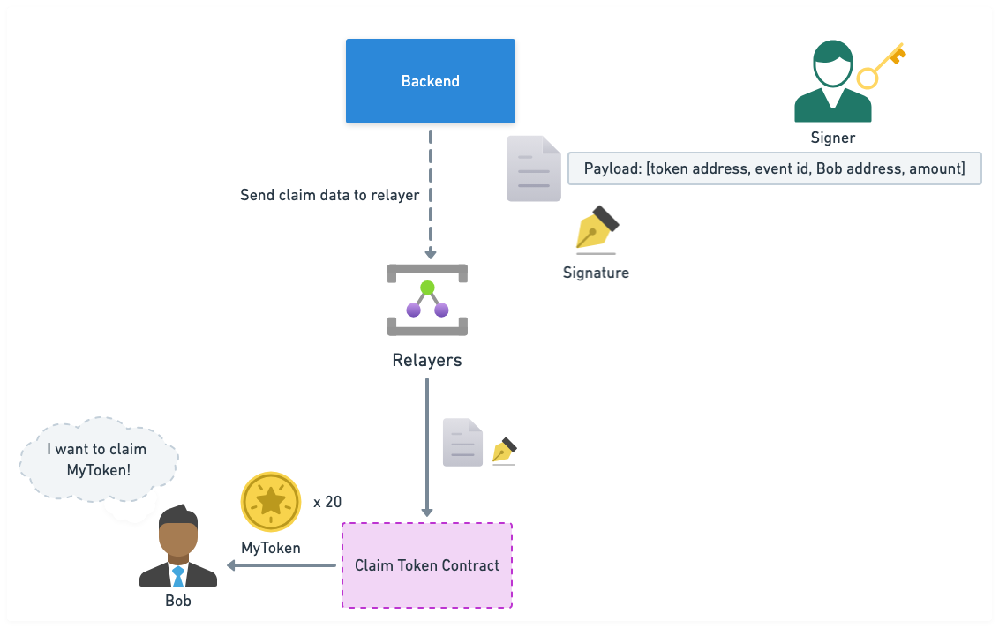

## ClaimToken Contract

The `ClaimToken` contract facilitates secure and efficient token distribution for events. It allows administrators to manage token-based events and signers, while ensuring users can claim their allocated tokens once, using a valid signature from authorized signers.

### Key Features:

- **Event Management**: Administrators can create, update, and close token events.
- **Claim Process**: Users claim tokens via a valid signature from activated signers.
- **Signer Management**: Administrators manage the list of authorized signers.

### Events:

- **SignerUpdated**: Triggered when a signer's status changes.
- **EventCreated**: Triggered when a token event is created.
- **EventUpdated**: Triggered when an event's status is updated.
- **Claimed**: Triggered when a user claims tokens.

### Functions:

- **Query Functions**:

  - `isSignerActivated`: Check signer status.
  - `getEvent`: Retrieve event status.
  - `getClaimStatus`: Check a user's claim status.

- **Administrative Functions**:
  - `updateSigners`: Manage signer list and statuses.
  - `createNewEvent`: Initiate a token event.
  - `updateEvent`: Modify event status.
  - `claim`: Users claim tokens using a valid signature.

## Setup & Update

Here are the setup and update processes:

1. **Setup**:  
   

2. **Update**:  
   

## Claim Process Flow

Visual representation of the claim process:

1. **Signer Signs Claim**:

   - Signer signs with `[token address, event id, user address, amount]`  
     

2. **Relayer Submission**:  
   

3. **Transaction Success**:

   - Indexer notifies backend after execution, updating claim status.  
     
